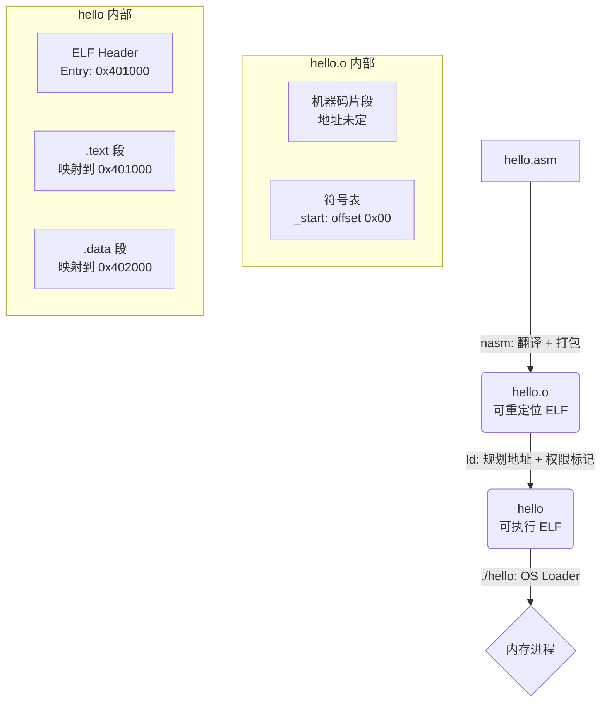

# 编译
```
nasm -f elf64 hello.asm -o hello.o   # 生成目标文件
ld hello.o -o hello                   # 链接成可执行文件
```



### 编译后的产物

```shell
$ file hello.o
hello.o: ELF 64-bit LSB relocatable, x86-64, version 1 (SYSV), not stripped
$ file hello
hello: ELF 64-bit LSB executable, x86-64, version 1 (SYSV), statically linked, not stripped
```

### 反汇编

#### hello.o

```shell
$ objdump -d -M intel hello.o

hello.o:     file format elf64-x86-64


Disassembly of section .text:

0000000000000000 <_start>:
   0:   b8 01 00 00 00          mov    eax,0x1
   5:   bf 01 00 00 00          mov    edi,0x1
   a:   48 be 00 00 00 00 00    movabs rsi,0x0
  11:   00 00 00 
  14:   ba 0e 00 00 00          mov    edx,0xe
  19:   0f 05                   syscall
  1b:   b8 3c 00 00 00          mov    eax,0x3c
  20:   bf 00 00 00 00          mov    edi,0x0
  25:   0f 05                   syscall
```

#### hello

```shell
$ objdump -d -M intel hello

hello:     file format elf64-x86-64


Disassembly of section .text:

0000000000401000 <_start>:
  401000:       b8 01 00 00 00          mov    eax,0x1
  401005:       bf 01 00 00 00          mov    edi,0x1
  40100a:       48 be 00 20 40 00 00    movabs rsi,0x402000
  401011:       00 00 00 
  401014:       ba 0e 00 00 00          mov    edx,0xe
  401019:       0f 05                   syscall
  40101b:       b8 3c 00 00 00          mov    eax,0x3c
  401020:       bf 00 00 00 00          mov    edi,0x0
  401025:       0f 05                   syscall
```

差别只在于hello.o的段地址未定，hello的段地址已定。